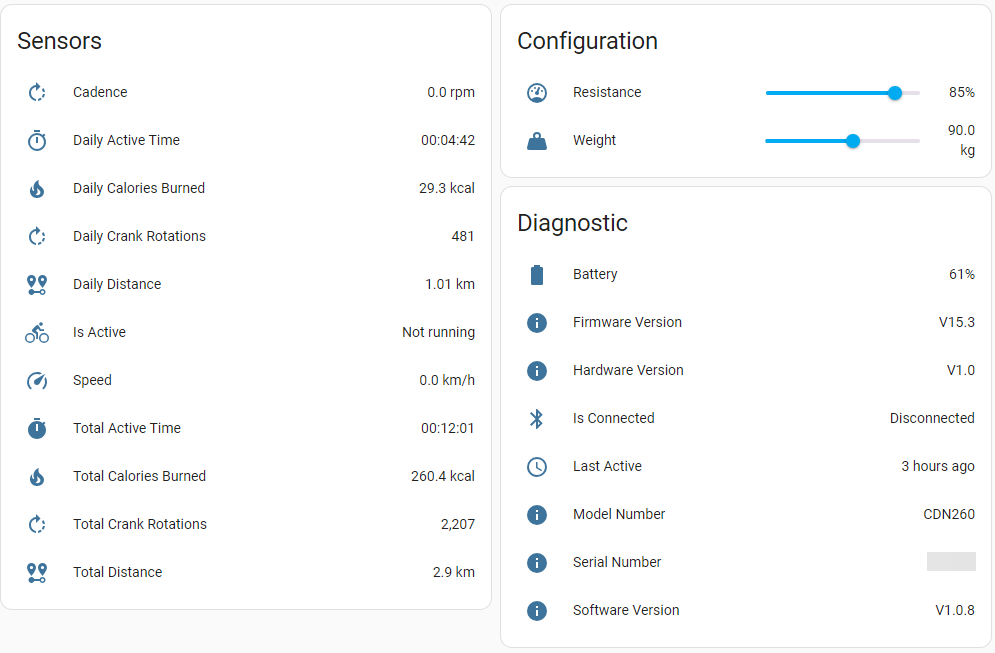

# DeskBike

Adds [DeskBike](https://deskbike.com/) support to [Home Assistant](https://www.home-assistant.io/).

Instead of opening each time your [DeskBike](https://deskbike.com/) App on the mobile, [Home Assistant](https://www.home-assistant.io/) will connect  automatically and collect the datas.

## Features

this custom component creates:

- A device in [Home Assistant](https://www.home-assistant.io/) for monitor a [DeskBike](https://deskbike.com/) with:
  - this sensors:
    - Cadence (rpm)
    - Daily Active Time (hh:mm:ss)
    - Daily Calories Burned (kcal)
    - Daily Crank Rotations
    - Daily Distance (km)
    - Is Active
    - Speed (kmh)
    - Total Active Time (d.hh:mm:ss)
    - Total Calories Burned (kcal)
    - Total Crank Rotations
    - Total Distance (km)
  - Configurations:
    - Cyclist Weight kg
    - Resistance %
  - Diagnostics:
    - Battery %
    - Firmware Version
    - Hardware Version
    - Is Connected
    - Last Active
    - Model Number
    - Serial Number
    - Software Version

## Requirements

This integration requires:

- [Home Assistant](https://www.home-assistant.io/)
- [DeskBike](https://deskbike.com)
- [Deskbike Bluetooth Sensor](https://deskbike.com/en/product/deskbike-app-fiets-tracker-bluetooth-cadence-sensor/), this is sometimes part of the DeskBike package.
- [HACS](https://hacs.xyz)
- a Bluetooth adapter
  - i use with a network connected [M5Stack Atom Lite](https://shop.m5stack.com/products/atom-lite-esp32-development-kit) configured as [Bluetooth Proxy](https://esphome.io/projects/index.html)
  - other adapters will work, too

## Setup

Recommended to be installed via [HACS](https://github.com/hacs/integration)

1. open your [Home Assistant](https://www.home-assistant.io/) instance
2. Go to [HACS](https://hacs.xyz)
3. click on the 3 dots top right and select `Custom Repositories`
4. type in repository `https://github.com/joshburkard/DeskBike`
5. select the Type `Integration` and click `ADD`
6. Search for [DeskBike](https://deskbike.com)
7. click on the 3 dots on the [DeskBike](https://deskbike.com) row and select `Download`
8. Restart [Home Assistant](https://www.home-assistant.io/)
9. use your [DeskBike](https://deskbike.com) after the restart, it should be automatically detected
10. add it to [Home Assistant](https://www.home-assistant.io/)
11. use it

## Configuration

Configure your ouwn weight and the resistance has an impact on the calculation of the burned calories.

## Notes

This custom component was created without any knowledge of [Python](https://www.python.org/) but with use of [Claude AI](https://claude.ai/) and [Microsoft CoPilot](https://copilot.cloud.microsoft/)

I have no rights and/or ownership on [DeskBike](https://deskbike.com/), any rights on [DeskBike](https://deskbike.com/) belongs to the maker of [DeskBike](https://deskbike.com/).

no warranty, that all calculations are correct - if you know it beter, i'm really interested in them.
